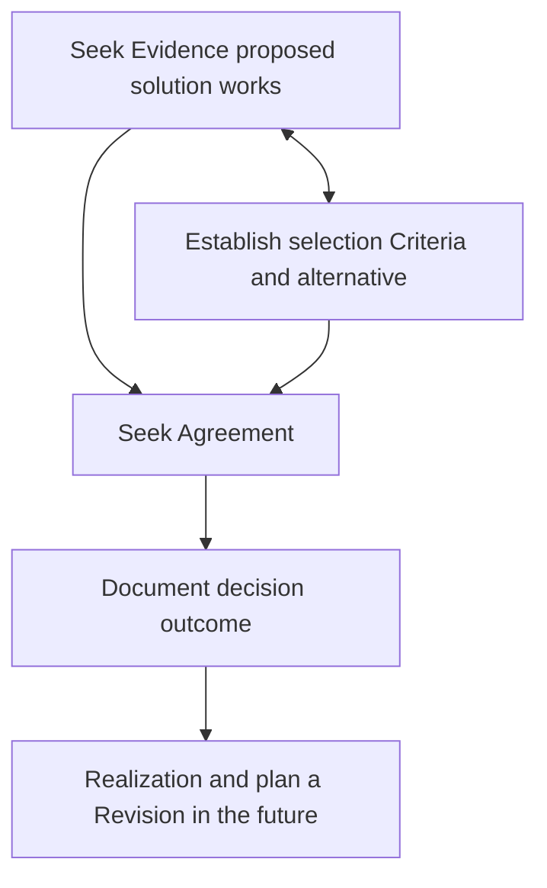

---
tags:
  - technicalWritting
  - softwareArchitecture
  - systemsDocumentation
---
#technicalWritting #softwareArchitecture  #systemsDocumentation

## Need

At work I am currently designing a new system together with my team. The system will start as an MVP, and in will be extended in features and scaled to users and regions over time.

With such scale of the system, the people working on the system will also scale, therefore the need to start with a lean documentation approach, something that is the minimum required for us to kick start, and iterate over it, adding the necessary layers.


## Types of documentation

1. **Product documentation:** Anything related to UI/UX design, functionality, users, business needs, and any other similar input that characterises the system
2. **Technical documentation:** Systems documentation including architecture (structure), best practices, non functional requirements. This documentation aims to describe the mechanics of how the system works. Within this type there are some subtypes I can identify:
	1. Non Functional requirements/-ilities, and how we measure them
	2. Systems/Architecture diagrams/C4Model
	3. RFCs/ADRs
	4. Practices etc


## When to do an RFC and when to do an ADR?

For that, let's look at this definition of software architecture

> “In most successful software projects, the expert developers working on that project have a **shared understanding of the system design**. This shared understanding is called ‘architecture.’ This understanding includes how the system is divided into components and how the components interact through interfaces. These components are usually composed of smaller components, but the architecture only includes the components and interfaces that are understood by all the developers.” 
> 
> Martin Fowler in Who needs an architect


Here we can get the point that suggest:
* Architecture is about the overall structure of the whole system, meaning Architecture > Design
* Architecture is a social construct because it depends on group consensus as well as on software.

So, within this context, and RFC is suitable to design decisions, and ADRS for architecture decisions.


### ADRs
[Alternative](https://www.industrialempathy.com/posts/design-docs-at-google/)
####  When to make an ADR

> Martin Fowler described an Architectural Decision (AD) as “a decision that you wish you could get right early” in an [IEEE Software article](http://ieeexplore.ieee.org/xpl/articleDetails.jsp?arnumber=1231144).

Translation: when the decision is **architecturally significant**.
**Architectural significance**
1.  Architectural decisions directly or indirectly determine the _non-functional characteristics (or qualities)_ of a system (think -ilities)
2.  Each decision describes a concrete, architecturally significant _design issue (problem)_ for which several potential _solution options_ exist and provides rationale for the _decision outcome_ (the selection of the chosen solution option, that is), for instance by arguing whether and how the desired quality attributes will be achieved.
3.  Architectural decisions concern a _software system as a whole_, or one or more of the _core components_ of such system (whatever the “core” might be).

**Architectural significance test**
Do this to decide if making an ADR makes sense for this use case
1.  Impact on _business value and risk?_
2.  _Key stakeholder concern?_
3.  _Unusual quality-of-service requirement_ (at least one order of magnitude more advanced than previous ones)?
4.  About _external dependencies that are uncontrollable, unpredictable or unreliable?_
5.  _Cross-cutting, system-wide impact?_
6.  _First-of-a-kind character_ (novelty for team)?
7.  Caused _bad experience and trouble in the past?_

[Source](https://ozimmer.ch/practices/2021/04/23/AnyDecisionRecords.html)


####  Process to make an ADR


[Source](https://ozimmer.ch/practices/2020/05/22/ADDefinitionOfDone.html)

**Process checklist**

- [x] Are we confident enough that this design will work (`Evidence`)?
- [] Have we decided between at least two options, and compared them (semi-)systematically (`Criteria`) ?
- [] Have we discussed among each other and with peers just enough and come to a common view (`Agreement`)?
- [] Have we captured the decision outcome and shared the decision record (`Document`)?
- [] Do we know when to realize, review and possibly revise this decision (`Realization  & Revise`)

**Suggested template**
[Decision record template by Michael Nygard](https://github.com/joelparkerhenderson/architecture-decision-record/blob/main/templates/decision-record-template-by-michael-nygard/index.md)


###  RFC

#### When to make an RFC
-   You want to frame a problem and propose a solution.
-   You want thoughtful feedback from team members on our globally-distributed remote team.
-   You want to surface an idea, tension, or feedback.
-   You want to define a project or design brief to drive project collaboration.
-   You need to surface and communicate around an important, highly cross-functional decision.

#####  When to skip the RFC
-   You want to discuss personal or sensitive topics one-on-one with another team member.
-   If you can decide on your own. In the vast majority of cases, creating an RFC to explain yourself will be overkill. RFCs should only be used if a decision explicitly requires one of the bullets in the section above.


#### Process
[Suggested process](https://handbook.sourcegraph.com/company-info-and-process/communication/rfcs/)

* Draft the proposal for the type of problem, feedback, practice, that you want to propose. Create spike if necessary
* Seek for comments and place a due date for the comments
* Bring topic to architecture forum, web guild or so, if necessary
* Plan and do implementation


**Open decision:**
Confluence? or Git?


#### TR Template
```
## Summary
### Goals
### Non Goals
## Overview
## Product requirements
# Detailed design
# Risks and unresolved questions
```
[Other alternatives]( https://blog.pragmaticengineer.com/rfcs-and-design-docs/)

```
-   Background
-   Proposal
-   Abandoned ideas
-   (Custom sections, for example:)
-   Implementation
-   UX
-   UI
```


#### Notations to consider
**Status**

Draft | Proposed | Published

**Type**

Experimental | Informational | Best Current Practice | Required

**Scope**

_The scope of work affected by the RFC document._

**Notational conventions**

The key words "MUST", "MUST NOT", "REQUIRED", "SHALL", "SHALL NOT", "SHOULD", "SHOULD NOT", "RECOMMENDED", "NOT RECOMMENDED", "MAY", and "OPTIONAL" in this document are to be interpreted as described in [BCP 14](https://www.rfc-editor.org/info/bcp14) [RFC2119](https://datatracker.ietf.org/doc/html/rfc2119), [RFC8174](https://datatracker.ietf.org/doc/html/rfc8174) when, and only when, they appear in all capitals, as shown here, and without quotes.

**Context**

_A description of the problem space and/or requirements that this RFC is set to address._

**Decision**

_A description of the proposed solution, which sets out the specifications of the implementation of the RFC. Should include specific details on how the solution addresses the requirements as laid out in the Context section._

**Consequences**

_Any consequences that are in play as a result of the decision being put into place._


## References

###  Technical decisions that scale the org

* [The Architecture Advice Process with Andrew Harmel-Law](https://www.infoq.com/podcasts/architecture-advice-process/)
* [Design docs at Google](https://www.industrialempathy.com/posts/design-docs-at-google/)
* [Architecture decision record resources and templates](https://github.com/joelparkerhenderson/architecture-decision-record)
* [Love Unrequited: The Story of Architecture, Agile, and How Architecture Decision Records Brought Them Together](https://ieeexplore.ieee.org/stamp/stamp.jsp?arnumber=9801811)
* [ADR = Any Decision Record? Architecture, Design and Beyond](https://ozimmer.ch/practices/2021/04/23/AnyDecisionRecords.html)
* [Who needs an architect?](https://martinfowler.com/ieeeSoftware/whoNeedsArchitect.pdf)

###  RFCS
* [Rust process](https://github.com/rust-lang/rfcs)
* [Planning for change with RFCs](https://increment.com/planning/planning-with-requests-for-comments/)
* [Scaling Engineering Teams via RFCs: Writing Things Down](https://blog.pragmaticengineer.com/scaling-engineering-teams-via-writing-things-down-rfcs/)


### Further reading
* [Design practice](https://socadk.github.io/design-practice-repository/artifact-templates/) Why? Seems more suitable for DDD, and the artifacts are similar to the ones we are currently using
* [Scaling Engineering Teams via RFCs: Writing Things Down](https://blog.pragmaticengineer.com/scaling-engineering-teams-via-writing-things-down-rfcs/)
* [6 Lessons I learned while implementing technical RFCs as a decision making tool](https://buriti.ca/6-lessons-i-learned-while-implementing-technical-rfcs-as-a-management-tool-34687dbf46cb)